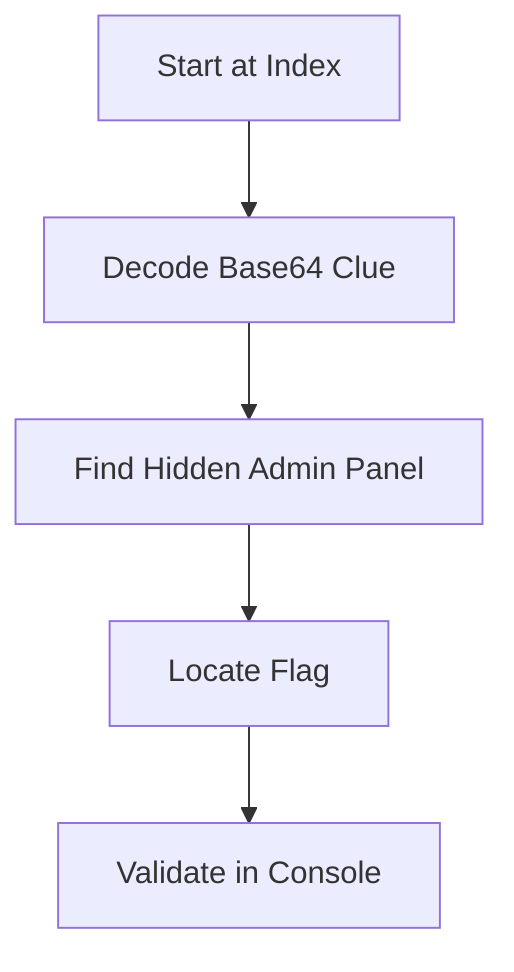

# 🕵️‍♂️🔐 DarkVault CTF Simulation Project 🌌💻

<p align="center">
  
</p>

## 🚀 Project Overview

Welcome to **DarkVault** - An immersive cybersecurity CTF simulation environment with hidden challenges and flags! This project simulates an underground hacking interface with multiple access points and secret pathways.

+ Key Features:
! Hidden CTF flag (Netrinix{...}) waiting to be discovered
# Interactive console with flag validation
* Animated login/registration sequences
> Multiple clues and red herrings
- Admin dashboard with secret access

## � Installation & Usage

1. Clone the repository:
   ```
   git clone https://github.com/yourusername/DarkVault-CTF.git
   ```
2. Open `index.html` in your browser
3. Start hunting for the flag!

## 🏆 Challenge Details



**Flag Format**: `#####{********}`  
**Difficulty**: Intermediate  
**Categories**: Web, Steganography, Forensic  

## 🕵️ How to Play

1. Explore the website interface
2. Find hidden clues
3. Submit your found flag in the System Console

## 🎥 Demo Preview

<p align="center">
  
</p>

## 🔗 Important Links

🌐 **Official Website**: [Netrinix.com](https://www.netrinix.com)  
📝 **Blog**: [SrinTech Blog](https://blog.srintech.in)  
📸 **Instagram**: [@secure.withsk](https://instagram.com/secure.withsk)  
▶️ **YouTube**: [@crackwithkumar1082](https://youtube.com/@crackwithkumar1082)  

## 🛠️ Technologies Used

<p align="center">
  
  
  
  
</p>

## 🤝 Contributing

Contributions are welcome! Please fork the repository and create a pull request.

```bash
# Standard fork workflow
1. Fork the project
2. Create your feature branch (git checkout -b feature/AmazingFeature)
3. Commit your changes (git commit -m 'Add some AmazingFeature')
4. Push to the branch (git push origin feature/AmazingFeature)
5. Open a Pull Request
```

## 📜 License

This project is licensed under the MIT License - see the [LICENSE.md](LICENSE.md) file for details.

<p align="center">
  
  <br>
  <em>Happy Hacking! 👨‍💻👩‍💻</em>
</p>
```
